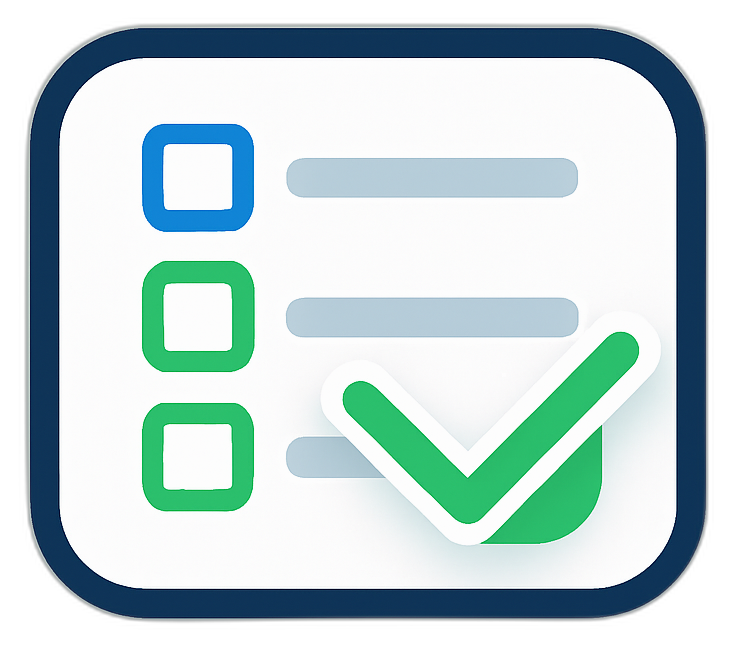

<<p align="center">
  
</p>

# FlowToDo

FlowToDo é uma aplicação web moderna, minimalista e responsiva para gestão de tarefas. Seu objetivo é ajudar pessoas a se manterem organizadas, reduzindo o stress e trazendo leveza à rotina.

## Visão Geral

FlowToDo proporciona:
- Cadastro e organização inteligente de tarefas diárias
- Definição de prioridade e data de vencimento
- Filtros inteligentes por estado, prioridade e vencimento usando componentes reutilizáveis personalizados (Input, Select, Label)
- Marcação rápida de tarefas concluídas, em apenas um clique, com botões de ação dinâmicos para cada status
- Interface adaptada para desktop, tablet e mobile, sempre clara e intuitiva

## Tecnologias

- **Backend:** Laravel 12 (PHP)
- **Frontend:** Vue.js (com Inertia.js)
- **Estilização:** Tailwind CSS, com componentes UI customizados reutilizáveis para formulários e botões
- **Base de dados:** MySQL
- **Monitoramento:** Laravel Telescope  
- **Helpers globais:** `app/Helpers/helpers.php`  
- **Gerenciamento de rotas no frontend:** Ziggy 

## Instalação e Uso

1. Clone este repositório:

```
git clone https://github.com/seu-usuario/flowtodo.git
cd flowtodo
```

2. Instale dependências backend e frontend:

```
composer install
npm install
```

3. Crie e configure o arquivo .env com as credenciais do banco de dados e a URL da aplicação:

```
APP_URL=http://flowtodo.test
DB_DATABASE=flowtodo
DB_USERNAME=root
DB_PASSWORD=

```

4. Execute as migrations:

```
php artisan migrate
```

5. Compile os assets do frontend:

```
npm run dev
```

6. Inicie o servidor local (Caso nao use o herd):

```
php artisan serve
```

7. Acesse em [translate:http://localhost:8000] ou [translate:http://nomedoprojeto.test] ou o domínio configurado no .env.

## Estrutura do Projeto

- `app/` - Lógica backend e Models
- `resources/js/` - Aplicação Vue (páginas e componentes)
- `public/` - Arquivos estáticos e imagens
- `routes/` - Definição de rotas Laravel
- `database/` - Migrations e seeders

## Novidades nas Últimas Atualizações

- Inclusão de componente [translate:Select.vue] customizado, estilizado igual ao componente [translate:Input.vue], para melhor consistência visual nos formulários
- Implementação de filtros avançados na listagem de tarefas com componentes [translate:Input], [translate:Select] e [translate:Label]
- Botões dinâmicos para gerenciamento rápido do status das tarefas dentro de Cards, com opções para iniciar, concluir, cancelar, desfazer ações e visualizar detalhes
- Melhorias na visualização de datas com formato [translate:d-m-Y]
- Paginação que preserva os filtros aplicados para navegação contínua e intuitiva

## Ziggy (Rotas Laravel no Frontend)

O projeto utiliza o Ziggy para compartilhar rotas Laravel com o frontend Vue, permitindo usar route('nome.da.rota') diretamente em arquivos Vue.

### Instalação

Se necessário, instale com:

```
composer require tightenco/ziggy
```

E publique as configurações (opcional):

```
php artisan ziggy:generate
```

No arquivo app.blade.php, o Ziggy é carregado automaticamente via:

```
@routes
```

Com isso, é possível usar as rotas Laravel dentro do Vue sem precisar definir URLs manualmente.

## Helpers Globais

O projeto conta com um arquivo de helpers globais em app/Helpers/helpers.php, permitindo a criação de funções reutilizáveis acessíveis em todo o sistema.

Essas funções são carregadas automaticamente via composer.json, na seção "autoload", e recompiladas com:

```
composer dump-autoload
```

## Monitoramento em Desenvolvimento com Laravel Telescope

O projeto já está configurado para uso com o Laravel Telescope, ferramenta que auxilia no monitoramento de requisições, queries SQL, autenticação e eventos durante o desenvolvimento.

- Facilite o debug de problemas, gargalos de performance e eventos importantes.
- Veja todos os detalhes de requests, logs, queries e métricas relevantes em uma interface intuitiva acessando http://localhost:8000/telescope (apenas em ambiente local).

### Instalação (caso não esteja ativa)

```
composer require laravel/telescope --dev
php artisan telescope:install
php artisan migrate

```

Acesse em:

Acesse o painel do Telescope em http://localhost:8000/telescope ou seusite.test/telescope.


> Recomendado manter ativado apenas em ambiente local para segurança e performance.

---

## Instalação (caso não esteja ativa)

Após instalar as dependências, configure o arquivo .env conforme seu ambiente local.

### Variáveis essenciais

```
APP_NAME=FlowToDo
APP_ENV=local
APP_DEBUG=true
APP_URL=https://flowtodo.test

DB_CONNECTION=mysql
DB_HOST=127.0.0.1
DB_PORT=3306
DB_DATABASE=flowtodo
DB_USERNAME=root
DB_PASSWORD=
```

### Variáveis adicionais usadas pelo projeto

Essas variáveis garantem o funcionamento de recursos extras como logs de atividade, Telescope e integração frontend.

### Activity Logger

Controla o registro automático das ações do usuário no sistema.

```
ACTIVITY_LOGGER_ENABLED=true
ACTIVITY_LOGGER_TABLE_NAME=activity_log
```
### Telescope (Monitoramento e Debug)

Controla a ativação do Laravel Telescope, ferramenta de inspeção de requisições, jobs, logs, queries e exceções.

```
TELESCOPE_ENABLED=true
TELESCOPE_PATH=telescope
TELESCOPE_DRIVER=database
TELESCOPE_BATCH_WATCHER=true
TELESCOPE_QUERY_WATCHER=true
TELESCOPE_VIEW_WATCHER=true
```

Importante: O Telescope deve permanecer ativado apenas em ambiente local (APP_ENV=local).
Em produção, desative com:

```
TELESCOPE_ENABLED=false
```

Projeto desenvolvido como parte de estágio acadêmico, focado em produtividade, organização e experiência intuitiva do usuário.


